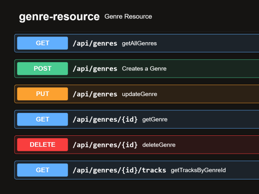
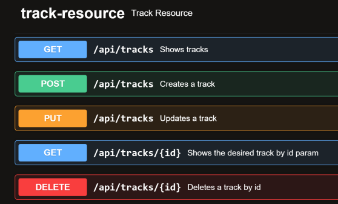
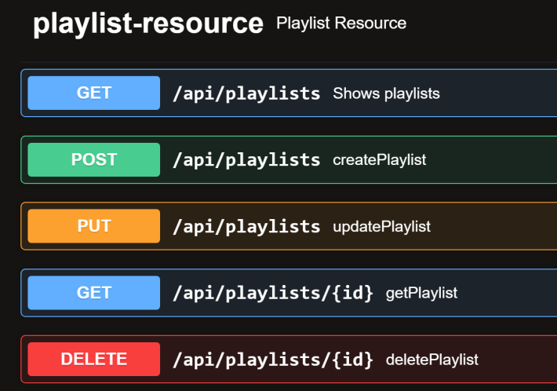
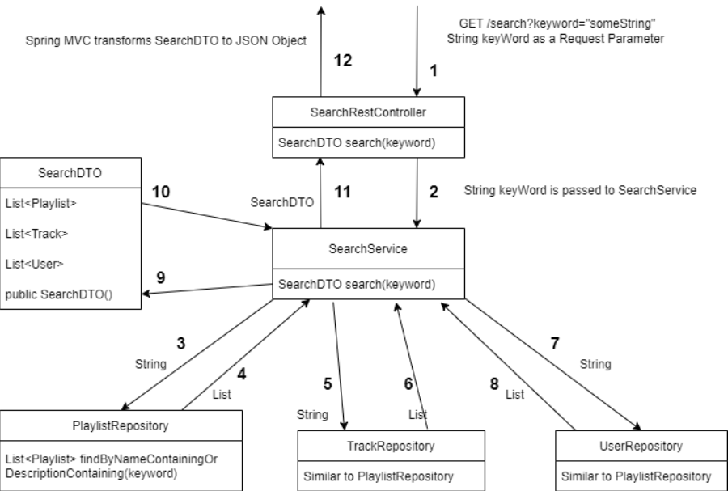

<h1 align="center">Apollofy project</h1>
<h3 align="center"> REST API based Backend using Java Spring Boot,Spring MVC, JPA and MySQL</h3>

What is Apollofy?

Apollofy is going to be a music platform inspired on real applications like Spotify or
SoundCloud.
Users will be able to access the application to play songs uploaded by themselves or songs
uploaded by others. They can also create playlists and can “like” both songs and playlists.

<h3 align="left">Sprint 1</h3>

<h3 align="left">Sprint 2</h3>

<h3 align="left">Sprint 3</h3>

The user will be able to search songs, playlists and users/artists.
 
 

